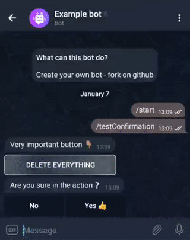
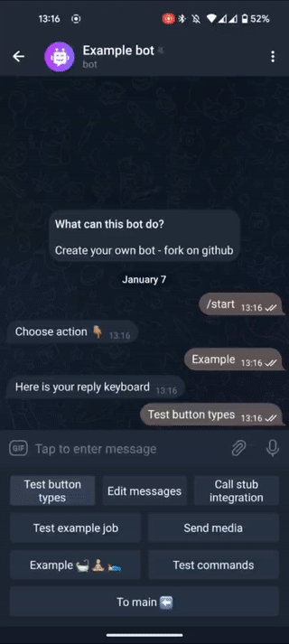

# abstract-telegram-bot

This is ready-to-use bot abstraction that based on:
- Groovy
- Spring Boot
- Telegram API based on webhooks

**[Check an example of current version](https://t.me/example_abstract_bot)**

_Release 2.1_

#### Release notes 2.1:
* Support creating Edit flow menus for Models marked with annotation

#### Release notes 2.0:
* Confirmation flow inline buttons
* Jobs support
* Sending media requests (photo, audio, documents)
* SetMyCommands method support
* Parsing methods: link urls, mentions
* Refactoring MessageFeatures. Small fixes


---
## How to start with your bot

- Fork
```shell
git clone git@github.com:khabaznia/abstract-bot.git <new-repo-name>
cd <new-repo-name>
git remote rename origin abstract
git remote add origin git@github.com:<new-repo-remote-link>
git push origin master 
```
- Register your bot with [BotFather](https://t.me/BotFather)
- Set [privacy mode](https://core.telegram.org/bots#privacy-mode) if needed for groups.
- Set configs
```shell
export DATABASE_URL=
export BOT_TOKEN=
export CHAT_ADMIN= 
export LOGGING_LEVEL= 
```
- Deploy
   - On local:
     - install [ngrok](https://ngrok.com/)
     - create DB
     - run 
     
    ```shell
    ngrok http 8083
    gradle clean build bootRun
    ```
   - Create app on heroku:
  
  ```shell
    heroku apps:create <app-name>
    heroku git:remote -a <app-name>
    heroku addons:create heroku-postgresql:hobby-dev -a <app-name>
    heroku ps:type hobby  
    heroku config:set LOGGING_LEVEL='INFO' BOT_TOKEN='<bot-token>' CHAT_ADMIN='<admin-chat>'
    git push heroku master
    ```
- Set webhook
> If your run on local use ngrok https alias as `<host-url>`
```shell
curl -F "url=<host-url>/<bot-token>" https://api.telegram.org/bot<bot-token>/setWebhook
```


---
# HOW TO USE:

## Map user input (commands).
The app based on webhook and use text input and chat id to understand what resource user wants to access.
Thus, all application resources are marked with the following corresponding annotations to ensure proper mapping:
- [`@BotController`](/src/main/groovy/com/khabaznia/bots/core/routing/annotation/BotController.groovy) - ***Mandatory***, intended to mark class as controller that aggregates specific command mappings. 
- [`@BotRequest`](/src/main/groovy/com/khabaznia/bots/core/routing/annotation/BotRequest.groovy) - ***Optional***, intended to mark method in bot controller with specific command mapping
- [`@Localized`](/src/main/groovy/com/khabaznia/bots/core/routing/annotation/Localized.groovy) - ***Optional***, intended to enable localization of specific command mapping (used in reply keyboards).
- [`@Secured`](/src/main/groovy/com/khabaznia/bots/core/routing/annotation/Secured.groovy) - ***Optional***, intended to restrict access to command mapping method to specific user [roles](https://github.com/khabaznia/abstract-bot#roles).  _Default - ALL_
- [`@Action`](/src/main/groovy/com/khabaznia/bots/core/routing/annotation/Action.groovy) - ***Optional***, intended to specify SendChatAction that should be sent to user, while request is processing. _Default - Typing_

> NOTE!
> You must extend your controller from [`AbstractBotController`](/src/main/groovy/com/khabaznia/bots/core/controller/AbstractBotController.groovy) to enable pre- and post- processing of update, and get access to specific [object](https://github.com/khabaznia/abstract-bot#available-methods) like sendMessage, editMessage, keyboard etc. 

Example:
```groovy
@BotController() // Mandatory annotation in order mark controller
class ExampleController extends AbstractBotController {

  @BotRequest(path = '/simpleCommand') // simple mapping for user input - /simpleCommand
  simpleCommand() {
    // ...
  }

  @Secured(roles = [Role.ADMIN])
  @BotRequest(path = '/simpleAdminCommand') // /simpleAdminCommand mapping that will be permited only for ADMIN user
  simpleCommandOnlyForAdmin() {
    // ...
  }

  @Action(actionType = ActionType.UPLOADPHOTO) // send specific action type while processing the request. Default ActionType.TYPING
  @BotRequest(path = '/sendMePhoto')
  willRespondWithPhoto() {
    // ...
  }

  @Localized
  @BotRequest(path = 'path.some') // localized mapping that will be invoked for any of this user input -  Some path  OR  Какой-то путь  OR   Якийсь шлях
  someLocalizedPath() {
    // ...
  }
}
```

message_en.properties: 
`path.some=Some path`

message_ru.properties:
`path.some=Какой-то путь`

message_uk.properties:
`path.some=Якийсь шлях`

You can use it all together
```groovy
  @Action(actionType = ActionType.RECORDVOICE)
  @Secured(roles = [Role.USER])
  @Localized
  @BotRequest(path = 'send.video.note')
  sendVideoNote() {
    // ...
  }
```

### Previous path

You can create you own flows using next feautures:
- in [`@BotRequest#after`](/src/main/groovy/com/khabaznia/bots/core/routing/annotation/BotRequest.groovy) you can specify previous action
- you can forward processing of same update to another command mapping by returning `String` from command mapping method with name of command.
- inject parameters from button to target command mapping method arguments

```groovy
  @BotRequest(path = '/firstAction') // first action
  someFirstAction() {
    sendMessage.text('Tap to go to next action') // send user simple message with one button
      .keyboard(inlineKeyboard.button("Got to next action", '/nextAction',
              [category: 'science'])) // parameter in button
  }
  
  @BotRequest(path = '/nextAction', after = "/firstAction") // this mapping will be invoked ONLY after /firstAction
  // Method returns String and this is trigger to forward to command mapping that will be returned
  String simpleCommandAfterPath(String category) { // The 'category' parameter will be injected from button param ('science' in this example)
    sendMessage.text("You-ve got the category -> $category")
    '/afterNext' // forward to another command
  }
  
  @BotRequest(path = '/afterNext') // This method is regular command, but also will be invoked from previous action 
  afterNextAction() {
    sendMessage.text('That\'s it')
  }
```

### Default mappings and flows

If there are no specific command mapping present in application, some default mappings will be used:

- /any_string - this command is used as empty path in [`@BotRequest`](/src/main/groovy/com/khabaznia/bots/core/routing/annotation/BotRequest.groovy)
- /default - default command mapping if no matching command was found
- /process_image - default command if user send image. Redirects this file to admin chat.
- /process_audio - default command if user send audio. Redirects this file to admin chat.
- /process_video - default command if user send video. Redirects this file to admin chat.

**Also, there some basic flows that are already implemented:**

- /start command that provides ROLE-specific keyboard.
- Changing language flow


- Switch configs flow for ADMIN only. See details in [configuration](https://github.com/khabaznia/abstract-bot#configuration).


### Roles
Eventually app based on two roles: **ADMIN** and **USER**. 
All controllers mapping based on these roles. 

For adding custom role you need:
- add this role to [`UserRole`](/src/main/groovy/com/khabaznia/bots/core/enums/UserRole.groovy) enum
- extend logic in [`UserService`](/src/main/groovy/com/khabaznia/bots/core/service/UserService.groovy) to specify how this role of user should be assigned
- extend [`Role`](/src/main/groovy/com/khabaznia/bots/core/enums/Role.groovy) enum with corresponding role (used in @Secured annotation restricting access to resource in bot controller)

## Available methods.

The app has implementation of [wrappers](/src/main/groovy/com/khabaznia/bots/core/meta/request/impl) to main api method:
_SendMessage, EditMessage, DeleteMessage, PinMessage, SendAudio, SendVideo, SendPhoto, SendChatAction, SetMyCommands, BanChatMember, LeaveChat, etc._
These objects intended to wrap data that should be sent to user in convenient way. 
Objects are based on Builder pattern, so you can fill its fields easily. 

The recommended way to use it - get needed bean from context, fill its fields, and execute it by publishing [ExecuteMethodsEvent](/src/main/groovy/com/khabaznia/bots/core/event/ExecuteMethodsEvent.groovy).
AbstractBotController contains methods that enables you to create such wrappers, and it will execute created wrappers after method invocation.

Let's check an example:

```groovy
@BotController
class ExampleController extends AbstractBotController {

  @BotRequest(path = '/command')
  someFirstAction() {
    sendMessage // this invokes method getSendMessage() from AbstractBotController that creates sendMessage object and then will execute it 
        .text('message.text.label')
        .label('mylabel')
        .keyboard(inlineKeyboard.button("Edit this message", '/editMessage'))
    sendAudio // this invokes method getSendAudio() from AbstractBotController that creates sendAudio object and then will execute it 
        .text('some caption to audio')
        .fileIdentifier('some_audio.mp3') // this media file should be stored in resources/media
  }

  @BotRequest(path = '/editMessage')
  editPreviousMessage() {
    editMessage // this invokes method getEditMessage() from AbstractBotController that creates editMessage object and then will execute it 
        .text('This was changed')
        .label('mylabel') // message with label 'myLabel' will be edited with new text and keyboard  
        .keyboard(inlineKeyboard.button("Next?", '/nextAction'))
  }
}
```

> Localization
Field `text` in wrappers is localized, so when request wrapper is converted to Telegram Api Methods, 
the localized property will be retrieved from messages.properties file using locale of current user.
Same for `text` fields in keyboard buttons.

### Keyboards, Buttons
Same to api methods, app contains wrappers for keyboards and buttons.
There are two types of keyboards:
[`InlineKeyboard`](/src/main/groovy/com/khabaznia/bots/core/meta/keyboard/impl/InlineKeyboard.groovy)
[`ReplyKeyboard`](/src/main/groovy/com/khabaznia/bots/core/meta/keyboard/impl/ReplyKeyboard.groovy)

Both of them has methods to create buttons. 
Let's proceed with example:

```groovy
  @Localized
    @BotRequest(path = '/example', enableDuplicateRequests = true)
    getReply() {
      sendMessage
        .text('Here is your reply keyboard')
        .replyKeyboard([[MODIFIABLE_INLINE_KEYBOARD, EDITING_MESSAGES, INTEGRATION_TESTS_KEYBOARD],
                        [EXAMPLE.addEmoji(MEDITATE)], 
                        [TO_MAIN.addEmoji(LEFT_ARROW)]])

    }
```


```groovy
  @Localized
  @BotRequest(path = 'path.modifiable.keyboard')
  getFeatures() {
    sendMessage.text('modifiable.inline.keyboard')
      .keyboard(inlineKeyboard
        .button('button.example.simple', AVOCADO, '/query', [(UNLIMITED_CALL): 'true']) 
        .buttonWithBinding('button.example.binding', '/query', [binding: 'Some'])
        .row()
        .oneTimeButton('button.one.time.simple', '/default')
        .oneTimeButton('button.one.time.with.query', BOAT, '/query')
        .oneTimeButton('button.one.time.with.param', '/queryWithParam', [someUniqueId: 'data from button'])
        .row()
        .switchButton('button.example.switch', '/default', true, [someUniqueId: 'some data from button']))
 }

  @BotRequest(path = '/query')
  query() {
    sendMessage.text('<b>query</b> - ok').delete()
  }
  
  @BotRequest(path = '/queryWithParam')
  query(String someUniqueId) {
    sendMessage.text("This param was in button request -> $someUniqueId").delete()
  }
```


### Additional `String` methods

[Formatting options](https://core.telegram.org/bots/api#formatting-options) available as methods on `String` class:
- bold()
- italic()
- underline()
- strikethrough()
- linkUrl(), linkText()- creates markup with link
- mentionUrl() - creates user mention link

```groovy
@BotRequest(path = '/checkTexts')
  checkTexts() {
    sendMessage.text('some bold'.bold())
    sendMessage.text('some italic'.italic())
    sendMessage.text('some underline'.underline())
    sendMessage.text('some strikethrough'.strikethrough())
    sendMessage.text('go to ' + 'github repo'.linkUrl('https://github.com/khabaznia/abstract-bot'))
    sendMessage.text('user'.linkUrl(currentChat.code.userMentionUrl()))

    // for localized values
    sendMessage.text('test.bold'.bold()) 
    sendMessage.text('test.italic'.italic()) 
    sendMessage.text('test.underline'.underline())
    sendMessage.text('test.strikethrough'.strikethrough())
  }
```


### MessageFeature
Each api method wrapper (BaseRequest) has [`MessageType`](/src/main/groovy/com/khabaznia/bots/core/enums/MessageType.groovy) that provides additional pre- and post- processing of the request.

- **PERSIST** - Just save to DB
- **DELETE** - Send message and deletes it with next request.
- **INLINE_KEYBOARD** - Default for message with inline keyboard. Inline keyboards can be updated. Saved in DB.
- **REPLY_KEYBOARD** - Default for message with reply keyboard. Saved in DB.
- **ONE_TIME_INLINE_KEYBOARD** -  Message with inline keyboard that should be deleted after its any button click.
- **PINNED** - After sending, saved to DB, send additional request to pin the message.
- **EDIT** - Edit existing message. Updates it in db. Default for `EditMessage`.
- **MEDIA** -  For AUDIO, IMAGE, VIDEO messages. Default for `SendPhoto`, `SendVideo`, `SendAudio`.

You can explicitly specify it in builder

```groovy
sendMessage
        .text('This message should be pinned')
        .feature(MessageFeature.PINNED)

sendMessage
        .text('This message will be deleted')
        .feature(MessageFeature.DELETE)

// or another variant for MessageType.DELETE   
sendMessage
        .text('This message will be deleted')
        .delete()
```

## Configuration 

The configuration of app is presented in [application.properties](/src/main/resources/application.properties) and [application.yml](/src/main/resources/application.yml) files

Config properties are saved to DB in order to save state of application while new release deploy. 
You can simply get config value using methods in [`Configurable`](/src/main/groovy/com/khabaznia/bots/core/trait/Configurable.groovy) trait.

There are specific prefixes for config properties:
- **env.only** - property don't saved to DB
- **switchable.config** - property should be boolean, and can be managed from [switch features flow](https://github.com/khabaznia/abstract-bot#default-mappings-and-flows) by admin user.

Next properties are needed to start application and should be specified as system properties (recommended) or in [application.yml](/src/main/resources/application.yml) file

```yaml
logging:
  level:
 ...
    com.khabaznia.bots: ${LOGGING_LEVEL} // mandatory to specify logging level

env.only:  
 ...
  bot:
    token: ${BOT_TOKEN} // mandatory, token of your bot
    admin.chat.id: ${CHAT_ADMIN} // mandatory, specified admin chat. Use https://t.me/userinfobot to check id of user
```

### Logging to chat

You can set any group as logging chat in order to check what actions are performed in the application, 
by **'/setLogging'** command that is available to admin.


Next type of logging available:
- **DEBUG** - logs every update info to specified `CHAT_LOGGING` if feature is enabled
- **INFO** - logs to message to `CHAT_LOGGING`. Use [`Loggable`](/src/main/groovy/com/khabaznia/bots/core/trait/Loggable.groovy) trait or publish [`LogEvent`](/src/main/groovy/com/khabaznia/bots/core/event/LogEvent.groovy) with specified message.
- **WARN** - logs any errors of application to `CHAT_LOGGING`, and duplicates the message to `CHAT_ADMIN` if feature is enabled

Use [`Loggable`](/src/main/groovy/com/khabaznia/bots/core/trait/Loggable.groovy) trait to log any message.

```properties
switchable.config.debug.logging.enabled=false
switchable.config.duplicate.warn.logging.to.admin=true
```

### Additional features:

#### Edit FLow

Edit flow feature allows you to perform **CRUD operations** with generated inlineKeyboard for specified entities or fields of entities

Using feature lays on two main objects:
- annotation [`@Editable`](/src/main/groovy/com/khabaznia/bots/core/flow/annotation/Editable.groovy) - intended to mark entities and it's fields that should be changed. 
- dto classes [`extending EditFlowDto`](/src/main/groovy/com/khabaznia/bots/core/flow/dto)  - intended to bind buttons in controller to specified flow with defining concrete entities/field to edit

Editable annotation allows you to specify:
* field type to define specific flow and persistance startegy: _STRING, NUMBER, BOOLEAN, SELECTIVE_ (for OneToMany & ManyToMany relations) and _LOCALIZED_(Map<String, String> to persist lang-value fields))
* Custom texts for each field: 
  * fieldButtonName - defines message that will be shown in field selection menu while you edit whole entity
  * enterMessage - defines message that will be displayed when expecting user input. E.g: 'Enter you age'
* for Media
      field types
      creation
      deleting

Additionally you can:
* add **validation** of user input before saving in db: just use spring validation annotations on fields
* specify **entity factory** to define specific **on-create logic**, and **custom view** in editEntityMenu
  * create class extending [`EntityFactory`](/src/main/groovy/com/khabaznia/bots/core/flow/factory/EntityFactory.groovy)
  * override methods: **createEntity** and **getView** for custom logic
  * add factory bean name in [`@Editable#entityFactory`](/src/main/groovy/com/khabaznia/bots/core/flow/annotation/Editable.groovy) annotation on model
* specify **selection startegy** to define custom selection logic for fields with relations (_SELECTIVE_)
  * create class extending [`FieldSelectionStrategy`](/src/main/groovy/com/khabaznia/bots/core/flow/strategy/FieldSelectionStrategy.groovy)
  * override parent methods for custom logic
  * add strategy bean name in [`@Editable#selectionStrategy`](/src/main/groovy/com/khabaznia/bots/core/flow/annotation/Editable.groovy) on Selective field


##### Let's check an example:

Define models with marking fields with @Editable annotation 
```groovy
@ToString(excludes = ['pointsToDiscuss'])
@Editable(entityViewHeader = 'meeting.header') // Custom header in entity view
@Entity(name = "meeting")
class Meeting {

    // ID field is mandatory. Should be Long and with name 'id'
    @Id 
    @Column(name = "id")
    @GeneratedValue(strategy = GenerationType.IDENTITY)
    Long id

    ...
    
    @Editable(enableClear = false, 
            id = true, // Only one field should be marked as id. Value in this field will be used as title for model instance
            fieldButtonMessage = 'meeting.title.name') // Custom message of field that used for button name/field view
    @Column(name = 'meeting_title')
    String title

    @Editable(type = MEDIA, mediaType = DOCUMENT, // Media type will expect user to upload media with specified mediaType
            enableClear = true, // Adds button that allows to clear value in curren field.
            fieldButtonMessage = 'meeting.attachment.name')
    @Column
    String attachment

    @Editable(viewOnly = true, // Field is displayed in entity view, but is not allowed to edit
            type = BOOLEAN, 
            fieldButtonMessage = 'meeting.upcoming.name')
    @Column(name = 'upcoming')
    Boolean upcoming

    @Editable(type = SELECTIVE, mappedBy = 'meeting', // Selective field should be marked with SELECTIVE type and provide mappedBy field name in related entity
            selectionStrategy = 'pointsSelectionStrategy', // Bean name of specific selection strategy
            fieldButtonMessage = 'meeting.points.to.discuss.name',
            enterMessage = 'meeting.points.to.discuss.enter.message') // Custom message that will be displayed before user input 
    @OneToMany(mappedBy = "meeting", cascade = [CascadeType.ALL], fetch = FetchType.LAZY)
    @Column(name = "points_to_discuss")
    Set<DiscussPoint> pointsToDiscuss
    ...
}


@ToString(excludes = ['meeting'])
@Editable(entityFactory = 'discussPointFactory') // Bean name of custom entity creating factory
@Entity(name = "discuss_point")
class DiscussPoint {

    @Id
    @Column(name = "id")
    @GeneratedValue(strategy = GenerationType.IDENTITY)
    Long id

    ...
    @Editable(id = true,
            fieldButtonMessage = 'discuss.point.title.name',
            enterMessage = 'discuss.point.title.enter.message')
    // Custom validation is supported. Error message will be displayed if user will violate constraint in regexp
    @Pattern(regexp = /^(.+) (.+)+$/, message = 'discuss.point.title.validation.title.is.too.small')
    @Column
    String title

    @Editable(enableClear = true, type = LOCALIZED, // Localized field enables to specify different values for each available lang
            fieldButtonMessage = 'discuss.point.description.name',
            enterMessage = 'discuss.point.description.enter.message')
    @ElementCollection
    @CollectionTable(name = 'discuss_point_localized_description',
            joinColumns = [@JoinColumn(name = 'id', referencedColumnName = 'id')])
    @MapKeyColumn(name = 'lang')
    @Column(name = 'description', columnDefinition = "TEXT")
    Map<String, String> description = [:]

    ...
}
```

**Example edit FIELD menu**

Create flow for fields on concrete entity:
```groovy

inlineKeyboard
     .button('Edit description', editFieldFlowDto
             .entityToEdit(pointToDiscuss) // (Mandatory) Entity to edit. (or specify entityClass and entityId)
             .fieldName('description') // (Mandatory) Field name
             .enterText('Update current description of $title') // (Optional) custom enter text message
             .enterTextBinding(['title': pointToDiscuss.title]) // (Optional) custom biding for enter text
             .redirectParams(params) // (Optional) some params that will be added on redirection to success path
             .successPath(TO_MAIN)) // (Optional) Success path after field editing (or canceling)
```


**Example edit ENTITY menu**

Create flow for concrete entity:

```groovy
keyboard(inlineKeyboard
     .button('Edit my awesome meeting', editEntityFlowDto
             .entityId(meetingId) // (Mandatory)
             .entityClass(Meeting.class) // (Mandatory) Or specify entityToEdit as in example higher, instead this two fields
             .entityFactory('meetingFactory') // (Optional) specific entity factory also can be defined here
             .enterText('Edit entity with id $id')  // (Optional) custom enter text message
             .enterTextBinding(['id': meetingId.toString()]) // (Optional) custom biding for enter text
             .redirectParams(params) // (Optional) some params that will be added while redirection to back path
             .backPath(EDIT_FLOW))) // (Optional) Adds button for return from the generated menu

```


**Example edit ENTITIES menu**

Create flows for list of entities:

```groovy
...
inlineKeyboard
     .button('button.my.meetings', Emoji.TEAM, MY_MEETINGS).row()
     .button('button.my.points.to.discuss', Emoji.EDIT, EDIT_MY_DISCUSS_POINTS).row()
...

@BotRequest(path = MY_MEETINGS)
myMeetingsMenu() {
    def myMeetings = ... // get which entities will be displayed to user
    sendMessage.text('text.meetings.select.entity')
            .keyboard(editFlowKeyboardService.addButtons(inlineKeyboard,
                    new EditEntitiesFlowKeyboardDto<Meeting>()
                            .entityClass(Meeting.class) // (Mandatory) Entities class
                            .entities(myMeetings) // (Mandatory) Entities to display/edit
                            .thisStepPath(MY_MEETINGS) // (Mandatory) Needed for returning after action on entities performed
                            .entityFactory('meetingFactory') // (Optional) specific entity factory also can be defined here (instead in annotation on type)
                            .backPath(EDIT_FLOW))) // (Optional) create back button 
}

@BotRequest(path = EDIT_MY_DISCUSS_POINTS)
editExampleModelEntries() {
    def discussPoints = ...  
    sendMessage.text('text.points.to.discuss.select')
            .keyboard(editFlowKeyboardService.addButtons(inlineKeyboard,
                    new EditEntitiesFlowKeyboardDto<DiscussPoint>()
                            .entityNameRetriever({ it -> it.title }) // (Optional) Specific logic how each entity button name in entity menu 
                            .entityClass(DiscussPoint.class)
                            .entities(discussPoints)
                            .fieldsInRow(1) // (Optional) Specifying number of field-columns in edit entity menu. Default - 3
                            .entitiesInRow(2) // (Optional) Specifying number of entities-columns in edit entities menu. Default - 3
                            .canDeleteEntities(false) // (Optional) restrict deleting entities. Default - true
                            .canCreateNewEntity(false) // (Optional) restrict creating entities. Default - true
                            .thisStepPath(EDIT_MY_DISCUSS_POINTS)
                            .redirectParams(params) // (Optional) some params that will be added while redirection to back path and this step path 
                            .backPath(EDIT_FLOW)))
}
```


#### Confirmation FLow

Often it is required to implement a confirmation of the action of a button. To unify this approach, support for the confirmation flow is provided.

All you need is to create a button with [`ConfirmationFlowDto`](/src/main/groovy/com/khabaznia/bots/core/flow/dto/ConfirmationFlowDto.groovy) and specify an **accept** path and a **decline** path.

##### Let's check an example:

```groovy
@BotRequest(path="/testConfirmation")
confirmation(){
    sendMessage.text('Very important button 👇🏽')
            .keyboard(inlineKeyboard
                    .button('DELETE EVERYTHING', confirmationFlowDto
                            .acceptPath('/confirm')
                            .declinePath('/decline')))
}

@BotRequest(path = '/confirm')
confirmationYes() {
    sendMessage.text "Done ✅"
    ... your code
}

@BotRequest(path = '/decline')
confirmationNo(String reason) {
    sendMessage.text "You saved your data"
    ... your code
}
```


Additionally, you can specify **back path**, **specific texts** for each button and add **params** next path processing.
```groovy
...
inlineKeybaord.button('button.with.confirmation', confirmationFlowDto
    .acceptPath('/confirmationYes')
    .acceptPathMessage('button.custom.yes')
    .declinePath('/confirmationNo')
    .declinePathMessage('button.custom.no')
    .backPathMessage('button.custom.back')
    .backPath(TO_MAIN)
    .params([reason: 'some reason']))
```

You can check how keyboards and buttons can be implemented in [ExampleController](/src/main/groovy/com/khabaznia/bots/core/controller/example/ExampleController.groovy).

#### Duplicate messages

Disables to access to the same resource as a previous action:
```yaml
block.duplicate.requests: true
```

Can be explicitly turned off for enabled feature:
- _for command mappings_ - [`@BotRequest#enableDuplicateRequests`](/src/main/groovy/com/khabaznia/bots/core/routing/annotation/BotRequest.groovy)
- _for buttons_ - using **UNLIMITED_CALL** parameter
```groovy
.button('button.example.simple', AVOCADO, '/query', [(UNLIMITED_CALL): 'true'])
```

#### Deleting old keyboards

Enables to delete old inline keyboards except the one that was sent as response to last update.
Helps to save chat history clean.

```properties
switchable.config.delete.previous.inline.keyboards=true
```

#### Sending requests in queue

As telegram api has [limits](https://core.telegram.org/bots/faq#my-bot-is-hitting-limits-how-do-i-avoid-this) of executing requests, there is a solution to execute requests in queue.

Feature is recommended if most of the messages sent in groups. 
For private chats it can be disabled.

```properties
switchable.config.execute.requests.in.queue=false
```
If 429 error is occurred, not send requests will be executed in queue, even if feature disabled.

Queue can be additionally configured by properties:
```yaml
chat.inactive.minutes: 15
requests.per.second: 33
requests.delay.limit.in.single.chat: 450
```

#### Restricted mode

If you want to restrict access to bot resources, you can specify comma-separated user ids and enable feature by configs: 
```yaml
restricted.mode: false
restricted.mode.users: ${RESTRICTED_USERS}
```

#### Database clean up job
Since messages and keyboards are stored in database, regular cronjob is needed to delete old and orphaned objects in DB.

The job is configurable by following properties:
```yaml
expired.paths.in.days.count: 2
clean.up.database.cron.expression: 0 0 2 * * *
```

#### Media service
Media service allows not to upload file if it used multiple times. It's saved in database with fileId that telegram API uses as unique identifier.

For following use of the file this unique **fileId** is sent instead of uploading file again.
[Read more](https://core.telegram.org/bots/api#sending-files)

#### Job service
Supports creating scheduled jobs that are saved and restored from database after server downtime

Steps to implement:
* Create you Job class extends `AbstractJob`
* Add **public** fields. These fields will be populated to model and saved to database.
* Override method `executeInternal()`
* Schedule job via `JobService`

```groovy
@Slf4j
@Component(value = 'exampleJob')
@Scope(value = 'prototype')
@Builder(builderStrategy = SimpleStrategy, prefix = '')
class ExampleJob extends AbstractJob {

    public String chatToSend

    @Autowired
    private ExampleMessagesService exampleMessagesService

    @Override
    protected void executeInternal() {
        requestsContainer << exampleMessagesService.simpleJobMessage(chatToSend)
        super.executeInternal()
    }

    @Override
    protected String getJobTitle() {
        'EXAMPLE JOB'
    }
}


ExampleJob job = context.getBean('exampleJob')
job.chatToSend = currentChat.code
jobService.scheduleJob(job, LocalDateTime.now().plusSeconds(5).toDate())
```

#### Deep linking support

You can pass additional params to /start command with `DeepLinkingService`.

[Read more](https://core.telegram.org/api/links#bot-links)

```groovy
inlineKeyboard.addButton(inlineButton
    .text('Deep link button')
    .url(deepLinkingPathService.generateDeepLinkPath('/commandToRedirectAfterStart', [param: currentChat.code])))
```



## API to send messages via bot

You can send messages via bot using api endpoint `/api/sendMessage/`
```json
{
    "chatId": "65534234", 
    "text": "Hi from api"
}
```
Field `chatId` is optional. If empty - sends message to admin user

Swagger documentation is available on `/swagger-ui`

Link to [Swagger of Example bot](https://example-abstract-bot.herokuapp.com//swagger-ui)

---
## Post MVP:
- [SetCommands](https://github.com/khabaznia/abstract-bot/issues/1) 
- [Payments](https://github.com/khabaznia/abstract-bot/issues/2)
- [Integration tests](https://github.com/khabaznia/abstract-bot/issues/4)
- [Wiremock for local testing of integrations :tada:](https://github.com/khabaznia/abstract-bot/issues/3)

---
### Useful links
- [Heroku](https://dashboard.heroku.com/)
- [Telegram API](https://core.telegram.org/bots/api)
